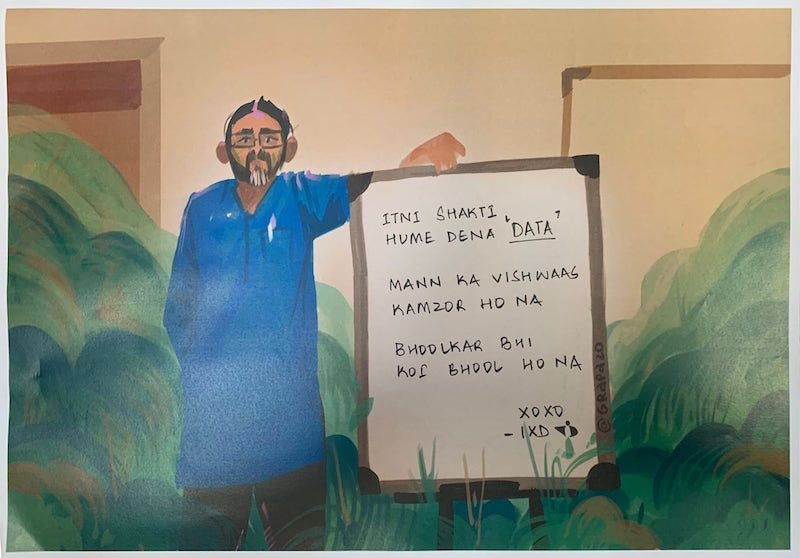

## Projects

0.	Amit — [amitkaps](https://github.com/amitkaps) :	<http://amitkaps.com/infovis>
1.	AbhishekB — [abhidx111](https://github.com/abhidx111) : <https://abhidx111.github.io/abhiroom>
2.	AbhishekG — [omfgabhi](https://github.com/omfgabhi) :	<https://omfgabhi.github.io/my-website>
3.	Akanksha — [ekankshya](https://github.com/ekankshya) :	<https://ekankshya.github.io/Infodata>
4.	Anavi	— [anavimitt](https://github.com/anavimitt) : 	<https://anavimitt.github.io/anavi>
5.	Annya — [annya-pearl](https://github.com/annya-pearl) :	<https://annya-pearl.github.io/infovis>
6.	Anshul — [grapazo](https://github.com/grapazo) :	<https://grapazo.github.io/infovis>
7.	Anubhav — [anubhavkukreti](https://github.com/anubhavkukreti): <https://anubhavkukreti.github.io/InfoViz>
8.	Anushri — [anusree-vs](https://github.com/anusree-vs) : <https://anusree-vs.github.io/DataVisualisation>
9.	Medha	— [medhapriya](https://github.com/medhapriya): <https://medhapriya.github.io/Information-Design>
10.	Meghana	— [kwlowski](https://github.com/kwlowski)	:	<https://kwloski.github.io/datawiz>
11.	Suraj	— [suraj3d](https://github.com/Suraj3D) : <https://suraj3d.github.io/surajdaddera>
12.	Varsha — [varshakichilu](https://github.com/VarshaKichilu) :	<https://varshakichilu.github.io/infovisualisation>
13.	Vishal — [anothervishal](https://github.com/anothervishal) : <https://anothervishal.me/infoviz>

## Resource List

- Project Sheets: <https://docs.google.com/spreadsheets/d/1IM8sS0-qSqp_0v9FJarq0emDM9qkeBJjminYQhsDWqM/edit?usp=sharing>
- Summary Figma: <https://www.figma.com/file/IE6zb8yPYUF0wZMhmvJygt/Summary>
- Master Data Visualisation Resources: <https://amitkaps.com/data-visualisation-resources>

## Major Project

- Three Project Ideas - Write it down.
- Project Guidelines: <https://amitkaps.com/guidelines>

## Minor Project

Select One Articles to **Recreate / Critique / Redesign**

- **Five Thirty Eight**: <https://fivethirtyeight.com>
  - Data for 538 articles: <https://data.fivethirtyeight.com>
- **Pudding.cool** - <https://pudding.cool>
  - Resources: <https://pudding.cool/resources/>
  - Data for articles: <https://github.com/the-pudding/data>

**What to do**
1.	**Data & Abstractions**:	Choice of data for the story & selection of the insight abstractions	
2.	**Visuals & Representations**:	Choice of appropriate visuals and data representations	
3.	**Aesthetics & Design**:	Choice of aesthetics for the visuals & design elements for the story	
4.	**Framing & Transition**:	Choice of framing the representations & transitioning across frames	
5.	**Messaging & Annotation**:	Choice of verbal messaging & text annotation to tell the story	
6.	**Flow & Coherence**:	Choice of flow of the narrative & coherence of the plot	
7.	**Interaction & Engagement**:	Choice of interaction elements & engaging the audience	

## Articles

- Reading for Day 1
  - Distill.pub: <https://distill.pub/2020/communicating-with-interactive-articles/>
  - Any article from Purpose & Value Section
- Reading for Day 2
  - Composing with Visual Devices: <a href="composing-with-visual-devices.pdf">pdf link</a>
  - Barbara Tversky: Visualising Thoughts: <http://mechanism.ucsd.edu/teaching/F12/cs200/Readings/tversky.visualizingthought.2010.pdf>
- Visual Vocabulary: <a href="visual-vocabulary.pdf">pdf link</a>

## Tools Installation

- Observablehq: <https://observablehq.com/collection/@amitkaps/ixd2021>
- Github Desktop: <https://desktop.github.com>
- VS Code: <https://code.visualstudio.com>

## Tools Practice

- Make 20 visualisation as SVG/PNG with:
  - Raw Graphs
  - Data Illutrator
  - Charticulator
  - Data Wrapper
- Get the Pudding Data for your article
  - Understand the tables
  - Get all of them in Sheets/Excel
  - Make Rough Visualisation
